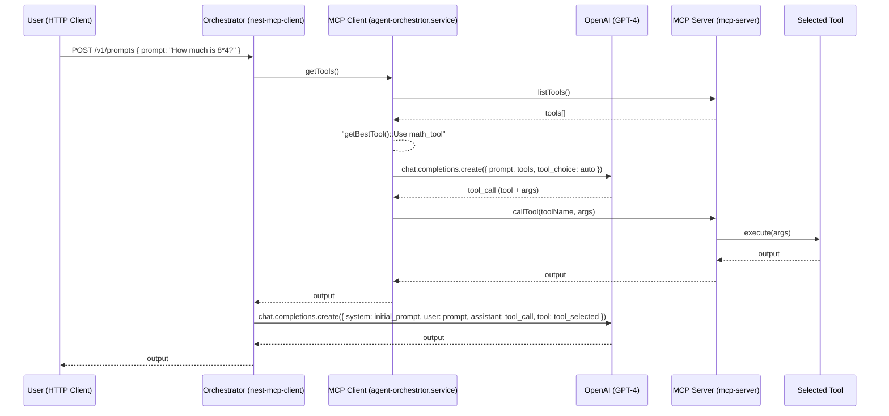
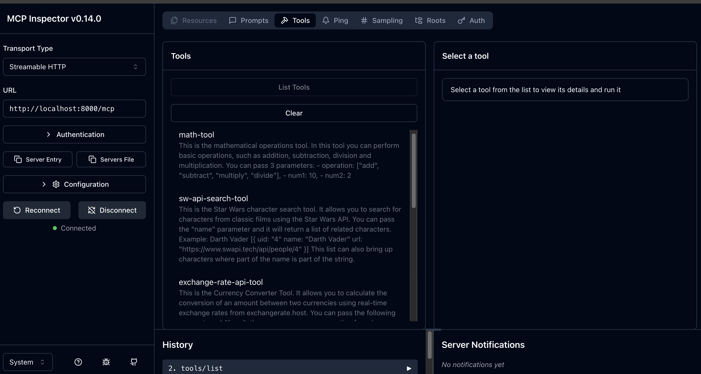

# MCP Prompt Orchestrator

This project implements a **Prompt Orchestrator** using the [MCP (Model Context Protocol)](https://modelcontextprotocol.org/) protocol, which guarantees the listing, invocation and management of tools in a standardized way and integrated with an LLM (Large Language Model), where in this case OpenAI GPT-4 was used.

In the context of this project:

- The **MCP Server** exposes the tools available for execution.
- The **MCP Client** (in this case, the orchestrator) searches for these tools and decides which one should be executed based on the prompt.

The project aims to create an **intelligent prompt orchestrator**, with followed capablities:

- POST via REST API;
- Evaluating which registered tool best responds to the intent of the prompt;
- Running the tool dynamically through the MCP Server;
- Responding back to the user based on the execution result.

Communication with LLM is done via OpenAI's API (Chat Completions), and tool call routing is done automatically.

## Sequence diagram



## MCP Tools

It is possible to add new tools to your MCP Server. Some tools implemented in this project include:

- `exchange-rate-tool`: Currency converter using `exchangerate.host`.
- `math-tool`: Basic numerical expression calculator.
- `sw-api-search-tool`: Character query from the Star Wars public API `swapi.tech`.
- `weather-tool`: Returns the current weather of a city using the Open-Meteo API `geocoding-api.open-meteo.com` and `api.open-meteo.com`.

The tools can be registered inside the `mcp-server/tools/` directory.

After declaring the `tool`, simply import it in the root of the project in the `main.ts` file

```node
    mathTools(server);
    swApiSearchTool(server);
    exchangeRateTool(server);
    weatherTool(server);
```

## Setup

* Node 20 or higher

```bash
git clone https://github.com/americoleonardo/mcp-prompt-orchestrator.git
```

### MCP Server

1. Create your key at https://exchangeratesapi.io
2. Store your key in the .env file under `EXCHANGE_API_KEY`

The final `.env` file should have the following structure

```sh
PORT=8000
SW_API=https://swapi.tech/api
EXCHANGE_API=https://api.exchangerate.host
EXCHANGE_API_KEY=

GEOCODING_API=https://geocoding-api.open-meteo.com/v1
OPEN_METEO_API=https://api.open-meteo.com/v1
```

Project structure
```sh
├── src
│   ├── domain
│   │   └── tools #MCP server tools
│   ├── infrastructure
│   │   └── http #Third party API vendors
│   ├── modules #MCP prompt sandbox 
│   └── presentation
│       └── mcp #MCP transport layer
└── types
```

```sh
cd mcp-prompt-orchestrator/mcp-server
nvm use
npm install
npm run start

> mcp-prompt-orchestrator-sample@1.0.0 start
> ts-node src/index.ts

MCP server is running on port 8000
```

### MCP Client

1. Create your OpenAI key at https://platform.openai.com/
2. If this is your first time creating an API Key, follow the tutorial https://www.youtube.com/watch?v=SzPE_AE0eEo
3. Store your key in the .env file under `OPENAI_API_KEY`

The final `.env` file should have the following structure

```
OPENAI_API_KEY=your-api-key
PORT=3000
```

Project strucutre
```sh
├── src
│   ├── config #environment setup
│   ├── domain
│   │   └── services #Orchestrator and service invoker
│   ├── infrastructure
│   │   └── mcp #Mcp client
│   ├── presentation
│   │   └── http #http Inbound Endpoints
│   └── types #Interfaces and types
└── test
```

```sh
cd mcp-prompt-orchestrator/nest-mcp-client
nvm use
npm install
npm run start:dev


[7:34:58 PM] Starting compilation in watch mode...

[7:35:02 PM] Found 0 errors. Watching for file changes.

[Nest] 74825  - 06/06/2025, 7:35:04 PM     LOG [NestFactory] Starting Nest application...
[Nest] 74825  - 06/06/2025, 7:35:04 PM     LOG [InstanceLoader] ConfigHostModule dependencies initialized +31ms
[Nest] 74825  - 06/06/2025, 7:35:04 PM     LOG [InstanceLoader] LoggerModule dependencies initialized +0ms
[Nest] 74825  - 06/06/2025, 7:35:04 PM     LOG [InstanceLoader] ConfigModule dependencies initialized +0ms
[Nest] 74825  - 06/06/2025, 7:35:04 PM     LOG [InstanceLoader] AppModule dependencies initialized +72ms
[19:35:04.600] INFO (nest-js-client-mcp/74825): [AgentOrchestrator] Injecting openai key
    context: "AgentOrchestrator"
[19:35:04.610] INFO (nest-js-client-mcp/74825): AppController {/v1/prompts}:
    context: "RoutesResolver"
[19:35:04.612] INFO (nest-js-client-mcp/74825): Mapped {/v1/prompts, POST} route
    context: "RouterExplorer"
[19:35:04.615] INFO (nest-js-client-mcp/74825): Nest application successfully started
    context: "NestApplication"
```

# Build with

* Node/Nestjs
* Node 22
* OpenAI
* MCP Oficial lib
* Zod
* Pino

### Testing sample

**With Math tool**
----------------------------
```sh
curl --location 'http://localhost:3000/v1/prompts' \
--header 'Content-Type: application/json' \
--header 'Accept: application/json, text/event-stream' \
--data '{
    "prompt": "How much is 8*4?"
}'
```

```sh
HTTP 200

{
    "message": "The result of 8 multiplied by 4 is 32."
}
```

**With Exchange tool**
----------------------------
```sh
curl --location 'http://localhost:3000/v1/prompts' \
--header 'Content-Type: application/json' \
--header 'Accept: application/json, text/event-stream' \
--data '{
    "prompt": "How much represent 100 usd in brazilian real?"
}'
```

```sh
HTTP 200

{
    "message": "100 USD represents approximately 556.69 Brazilian Real."
}
```

**With SW characters**
----------------------------
```sh
curl --location 'http://localhost:3000/v1/prompts' \
--header 'Content-Type: application/json' \
--header 'Accept: application/json, text/event-stream' \
--data '{
    "prompt": "How many characters have Darth as part of name?"
}'
```

```sh
HTTP 200

{
    "message": "There are 2 characters with \"Darth\" as part of the name:\n\n1. [Darth Vader](https://www.swapi.tech/api/people/4)\n2. [Darth Maul](https://www.swapi.tech/api/people/44)"
}
```

**With weather**
----------------------------
```sh
curl --location 'http://localhost:3000/v1/prompts' \
--header 'Content-Type: application/json' \
--header 'Accept: application/json, text/event-stream' \
--data '{
    "prompt": "What is the temperature in new york?"
}'
```

```sh
HTTP 200

{
    "message": "The weather in New York, United States is currently 28.9°C. The wind speed is 15.3 km/h coming from the direction 236°."
}
```


#### Using MCP Inspector

```sh
cd mcp-prompt-orchestrator/mcp-server
npm run inspect

> mcp-prompt-orchestrator-sample@1.0.0 inspect
> npx @modelcontextprotocol/inspector ./dist/server.js

Starting MCP inspector...
⚙️ Proxy server listening on port 6277
🔍 MCP Inspector is up and running at http://127.0.0.1:6274 🚀
```

